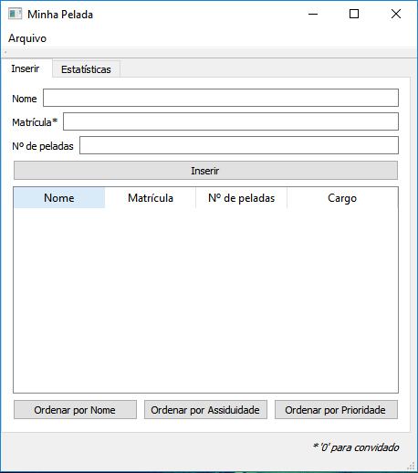

# Minha Pelada
### Aplicação desenvolvida em [QT](http://www.qt.io) a fim de registrar e gerenciar peladas

Esta aplicação permite que o usuário insira o nome do peladeiro, sua matrícula e o número de peladas disputadas pelo mesmo. A interface inicial da aplicação está demonstrada na figura abaixo.

