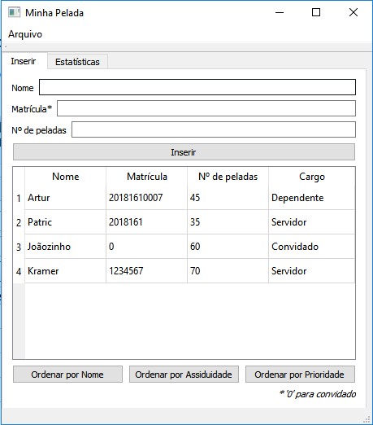
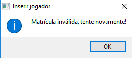
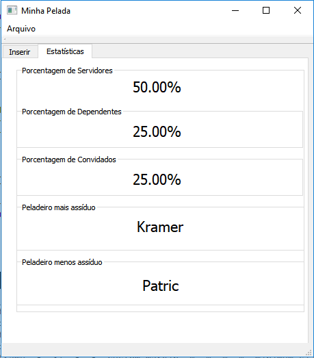
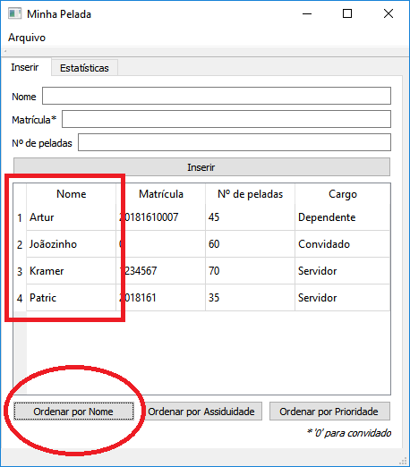
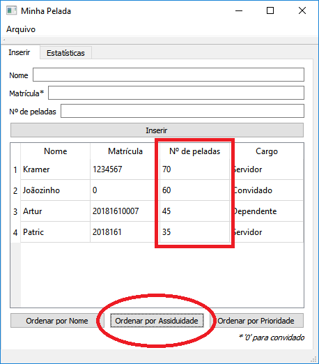
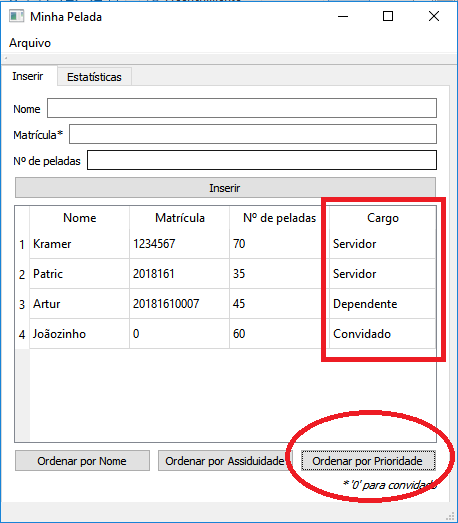
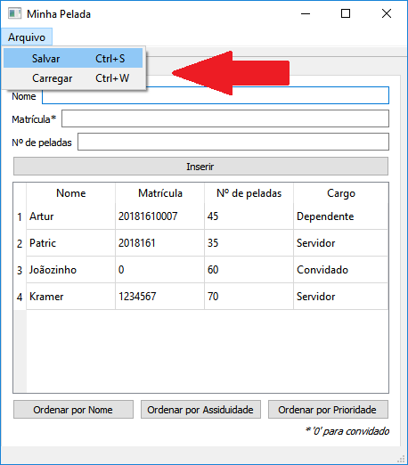
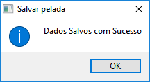
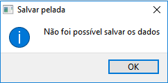

# Minha Pelada
### Aplicação desenvolvida em [QT](http://www.qt.io) a fim de registrar e gerenciar peladas

Esta aplicação permite que o usuário insira o nome do peladeiro, sua matrícula e o número de peladas disputadas pelo mesmo, e através de sua matrícula determinar o cargo do peladeiro, ou seja, se este é Servidor, Dependente ou Convidado. A interface inicial da aplicação está demonstrada na figura abaixo.

Como pode-se ver, essa aba inicial denominada "Inserir", possui na parte superior, três Labels e três Line Edits, nos quais o usuário pode inserir os dados do peladeiro desejado. Abaixo desses itens ditos anteriormente possui uma Table Widget(tabela) na qual são inseridos, após o PushButton "Inserir" for clicado, os dados do peladeiro em questão. Vale ressaltar que existe também uma observação abaixo da Table Widget, que se refere ao símbolo *.

Caso o usuário insira uma matrícula inválida, ou seja, diferente de 11 dígitos(Dependente), de 7 dígitos(Servidor) ou da matrícula "0"(Convidado), e tente inserir os dados do peladeiro na Table Widget, será mostrada uma QMessageBox com a mensagem "Matrícula inválida, tente novamente!", não serão inseridos os dados, e a Line Edit referente à matrícula será limpa, a fim de o usuário inserir uma nova matrícula.

A aplicação possui também uma aba denominada "Estatísticas" referente aos dados inseridos na tabela. Essa aba está demonstrada na figura abaixo.

Essa aba, como pode-se observar, possui 5 Group Boxes e 5 Labels. Nos três primeiros são mostrados a quantidade em porcentagem de cada cargo existente na tabela. Os dois últimos são responsavéis por mostrar o peladeiro mais assíduo e o menos assíduo, respectivamente, tudo segundo dados extraídos da Table Widget da aba "Inserir".

## Ordenações

A aplicação também é capaz de realizar ordenações, no momento em que o usuário clica determinado PushButton. Primeiramente, pode-se ordenar os dados da Table Widget por nome dos peladeiros, ao clicar o PushButton que contém a mensagem "Ordenar por Nome", como demonstrado a seguir:

Seguindo, o usuário também pode optar por ordenar por assiduidade, ou seja, por ordem decrescente do número de peladas, ao pressionar o PushButton que contém a mensagem "Ordenar por Assiduidade", como demostrado na figura abaixo:

Por fim, o mesmo pode optar por ordenar por prioridade da pelada, ao pressionar o PushButton que contém a mensagem "Ordenar por Prioridade", levando em conta que servidores possuem maior prioridade do que dependentes, que por sua vez, possuem mais prioridade do que convidados. Essa ordenação está demonstrada a seguir:

## Salvar e Carregar

Na parte superior esquerda da aplicação existe uma opção denomidada "Arquivo" na qual quando clicada pelo usuário, mostra duas opções: "Salvar" ou "Carregar". A opção "Salvar" permite ao usuário salvar em um arquivo (.txt) os dados presentes na Table Widget e esta opção também pode ser acessada através de um atalho que é "Ctrl+S". A opção "Carregar" permite ao usuário abrir um arquivo já salvo anteriormente pela aplicação e mostrar os dados na Table Widget. Como a opção "Salvar, a opção "Carregar" também possui um atalho para ser acessada mais facilmente que é "Ctrl+W".

Caso ocorra tudo bem e o usuário obtenha sucesso ao salvar os dados da Table Widget num arquivo (.txt), será mostrada uma QMessageBox, com a informação "Dados Salvos com Sucesso!".

Caso contrário, e o usuário não obtenha êxito na ação de salvar, será mostrada um QMessageBox com a mensagem "Não foi possível salvar os dados".

## Editar Dados

A aplicação também possui um recurso que permite ao usuário editar os dados presentes na Table Widget, ao clicar duas vezes sobre a célula da tabela na qual o mesmo queira editar as informações.

Se o usuário clicar duas vezes sobre alguma célula da primeira coluna da tabela, aparecerá um QInputDialog com a mensagem "Insira o novo nome:" e uma Line Edit que permite inserir o novo nome q substituirá o conteúdo antigo presente na célula clicada.

